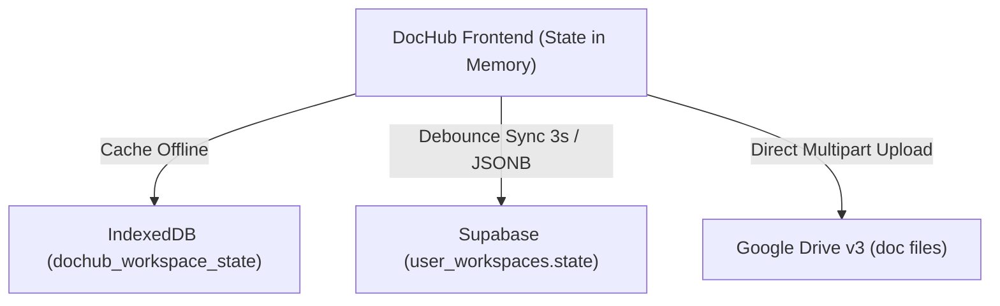

# DOCUB v2.2 — BẢN CHỤP MÔ HÌNH DỮ LIỆU HIỆN TẠI (DATA MODEL SNAPSHOT)

> **Mục đích**: Tài liệu này đóng băng và đặc tả chi tiết toàn bộ cấu trúc dữ liệu, quan hệ thực thể, cơ chế đồng bộ và lưu trữ của DocHub tại mốc **Phase 0 — Stabilization Baseline (`v2.2-stable-ui`)** trước khi tiến hành chuẩn hóa cơ sở dữ liệu ở Phase 1.

---

## 1. Kiến Trúc Lưu Trữ Tổng Thể

Hệ thống hiện tại hoạt động theo mô hình **Client-Side State Monolith with Cloud Backup**:
- **Trình duyệt (Frontend)**: Giữ toàn bộ cây thư mục, tệp tin, phân quyền, người dùng trong một đối tượng trạng thái duy nhất (`state`).
- **IndexedDB**: Cache cục bộ toàn bộ `state` dưới khóa `dochub_workspace_state` để hỗ trợ offline tức thì.
- **Supabase PostgreSQL**: Lưu trữ bản sao lưu `state` dưới dạng một khối JSONB nguyên khối trong bảng `user_workspaces`.
- **Google Drive v3**: Lưu trữ nhị phân các tệp tài liệu thật (`driveFileId`), trong khi metadata vẫn nằm trong `state.documents`.



---

## 2. Schema PostgreSQL Hiện Tại (Supabase)

### 2.1. Bảng `user_workspaces`
Lưu trữ toàn bộ snapshot trạng thái không gian làm việc của người dùng.

```sql
CREATE TABLE public.user_workspaces (
    workspace_id TEXT NOT NULL,
    owner_id UUID NOT NULL REFERENCES auth.users(id) ON DELETE CASCADE,
    name TEXT NOT NULL DEFAULT 'Không gian làm việc',
    state JSONB NOT NULL DEFAULT '{}'::jsonb,
    updated_at TIMESTAMPTZ NOT NULL DEFAULT timezone('utc'::text, now()),
    created_at TIMESTAMPTZ NOT NULL DEFAULT timezone('utc'::text, now()),
    PRIMARY KEY (workspace_id, owner_id)
);
```

### 2.2. Bảng `documents_index`
Bảng phụ trợ lập chỉ mục tìm kiếm và liên kết Google Drive file id.

```sql
CREATE TABLE public.documents_index (
    id TEXT PRIMARY KEY,
    owner_id UUID NOT NULL REFERENCES auth.users(id) ON DELETE CASCADE,
    workspace_id TEXT NOT NULL,
    parent_id TEXT NOT NULL,
    name TEXT NOT NULL,
    ext TEXT,
    bytes BIGINT DEFAULT 0,
    drive_file_id TEXT,
    drive_web_view_link TEXT,
    mime_type TEXT,
    starred BOOLEAN DEFAULT FALSE,
    deleted_at TIMESTAMPTZ,
    updated_at TIMESTAMPTZ NOT NULL DEFAULT timezone('utc'::text, now()),
    created_at TIMESTAMPTZ NOT NULL DEFAULT timezone('utc'::text, now())
);
```

---

## 3. Cấu Trúc Chi Tiết của Khối `state` JSON

Đối tượng `state` nguyên khối bao gồm các mảng thực thể sau:

### 3.1. `state.workspace`
```json
{
  "id": "ws_default",
  "name": "Không gian doanh nghiệp",
  "subtitle": "Tài liệu & tri thức nội bộ",
  "ownerId": "u1",
  "createdAt": "2026-09-01T00:00:00.000Z",
  "updatedAt": "2026-09-15T12:00:00.000Z"
}
```

### 3.2. `state.folders`
Mỗi thư mục được định danh bằng một chuỗi ID duy nhất. Cây thư mục được tổ chức theo quan hệ `parentId`. Thư mục gốc cao nhất có ID là `"all"`. Các phòng ban cấp 1 có `parentId: "all"`.

| Thuộc tính | Kiểu | Mô tả |
| :--- | :--- | :--- |
| `id` | `string` | Khóa chính duy nhất (VD: `"training"`, `"hr-dept"`) |
| `parentId` | `string \| null` | ID thư mục cha (`"all"` đối với phòng ban gốc) |
| `name` | `string` | Tên hiển thị của thư mục |
| `starred` | `boolean` | Trạng thái ghim trên sidebar |
| `starredAt` | `string \| null` | Thời điểm ghim (ISO 8601) |
| `inherit` | `boolean` | `true`: Kế thừa quyền từ cha; `false`: Ngắt kế thừa |
| `createdAt` | `string` | Thời gian tạo (ISO 8601) |
| `updatedAt` | `string` | Thời gian cập nhật lần cuối (ISO 8601) |
| `deletedAt` | `string \| null` | `null`: Đang hoạt động; ISO string: Nằm trong thùng rác |

### 3.3. `state.documents`
Danh sách toàn bộ tệp tin trong không gian làm việc.

| Thuộc tính | Kiểu | Mô tả |
| :--- | :--- | :--- |
| `id` | `string` | Khóa chính duy nhất (VD: `"d11"`, `"doc_172640123"`) |
| `parentId` | `string` | ID thư mục chứa tệp tin |
| `name` | `string` | Tên tệp đầy đủ (kèm phần mở rộng) |
| `ext` | `string` | Phần mở rộng (`"pdf"`, `"docx"`, `"xlsx"`, `"png"`) |
| `bytes` | `number` | Dung lượng tệp tính bằng byte |
| `driveFileId` | `string \| null` | Google Drive File ID nếu đã đồng bộ đám mây |
| `driveWebViewLink` | `string \| null` | Đường dẫn xem trực tiếp trên Google Drive |
| `content` | `string \| null` | Nội dung văn bản (đối với tệp mẫu hoặc text) |
| `ownerId` | `string` | ID của người dùng sở hữu/tải lên tệp (`"u1"`) |
| `description` | `string` | Mô tả ngắn gọn về tài liệu |
| `starred` | `boolean` | Trạng thái đánh dấu yêu thích/ghim |
| `kind` | `"file"` | Phân loại thực thể (luôn là `"file"`) |
| `sample` | `boolean` | `true`: Tài liệu dựng mẫu có sẵn |
| `source` | `string` | Nguồn tạo (`"sample"`, `"upload"`, `"edited_copy"`) |
| `createdAt` | `string` | Thời gian tạo (ISO 8601) |
| `updatedAt` | `string` | Thời gian cập nhật (ISO 8601) |
| `deletedAt` | `string \| null` | Thời gian đưa vào thùng rác (`null` nếu còn hoạt động) |

### 3.4. `state.users` & `state.groups`
Mô hình định danh và phân nhóm người dùng:
```json
{
  "users": [
    {
      "id": "u1",
      "name": "Vũ Ngọc Lan",
      "email": "lan.vu@example.com",
      "department": "Phòng hành chính",
      "groupIds": ["g-system", "g-admin"],
      "active": true
    }
  ],
  "groups": [
    {
      "id": "g-system",
      "name": "Quản trị hệ thống",
      "description": "Nhóm quản trị viên toàn quyền"
    }
  ]
}
```

### 3.5. `state.permissions`
Danh sách các quy tắc phân quyền gán trực tiếp trên từng thư mục:
```json
{
  "permissions": [
    {
      "folderId": "all",
      "principalType": "group",
      "principalId": "g-admin",
      "role": "manager"
    },
    {
      "folderId": "training",
      "principalType": "user",
      "principalId": "u2",
      "role": "editor"
    }
  ]
}
```

**Các quyền và vai trò**:
- `viewer`: Chỉ đọc, tải xuống, xem trước. Không được tạo, sửa, xóa hay chia sẻ.
- `editor`: Có quyền của Viewer + tải lên tài liệu mới, đổi tên, tạo bản sao chỉnh sửa.
- `manager`: Toàn quyền trên thư mục: Quản lý quyền, đổi tên thư mục, xóa thư mục/tệp.

### 3.6. `state.audit_logs`
Nhật ký các hoạt động gần đây của người dùng:
```json
{
  "audit_logs": [
    {
      "id": "act_172640123",
      "timestamp": "2026-09-15T12:00:00.000Z",
      "actorId": "u1",
      "action": "Tải lên tài liệu",
      "targetId": "d11",
      "targetName": "Sổ tay hội nhập nhân viên.pdf",
      "icon": "upload"
    }
  ]
}
```

---

## 4. Cơ Chế Đồng Bộ & Vòng Đời Dữ Liệu

1. **Khởi động ứng dụng**:
   - Ứng dụng đọc snapshot từ `IndexedDB` để hiển thị UI trong < 50ms.
   - Nếu đã đăng nhập Supabase, một truy vấn `SELECT state FROM user_workspaces` được thực hiện. Nếu phiên bản Supabase mới hơn, local state được cập nhật tương ứng.
2. **Ghi dữ liệu (Write operations)**:
   - Mọi thao tác (tạo folder, sửa tên, gán quyền, upload file) cập nhật trực tiếp biến `state` trong RAM.
   - Hàm `commit()` ghi ngay lập tức vào `IndexedDB`.
   - Hàm `scheduleCloudSync()` thiết lập bộ đếm debounce **3000ms** trước khi gửi payload `UPDATE user_workspaces SET state = ...` lên Supabase nhằm tối ưu băng thông mạng.
3. **Tệp nhị phân trên Google Drive**:
   - Khi người dùng chọn tệp từ máy tính, tệp được upload trực tiếp lên Google Drive v3 thông qua multipart upload REST API.
   - Trả về `driveFileId` và lưu ID này vào bản ghi document tương ứng trong `state.documents`.

---

## 5. Các Hạn Chế Kiến Trúc của Mô Hình Hiện Tại Cần Giải Quyết ở Phase 1

1. **Khối JSONB Monolith không thể mở rộng (Scalability bottleneck)**:
   - Mỗi lần lưu một chỉnh sửa nhỏ (ví dụ: đổi tên 1 tệp), toàn bộ JSON cây thư mục và danh sách hàng ngàn tệp đều phải tuần tự hóa và gửi lại toàn bộ lên database.
2. **Thiếu RLS Granular ở tầng Database**:
   - Quyền hạn (ACL) hiện được kiểm tra ở client-side JavaScript. Bất kỳ người dùng nào có token đều có thể đọc/ghi toàn bộ cột `state` nếu RLS chỉ chặn ở cấp `workspace_id`.
3. **Xung đột ghi đè đồng thời (Concurrent Write Conflict)**:
   - Nếu 2 người dùng cùng sửa dữ liệu trên cùng một workspace, người gửi sau sẽ ghi đè toàn bộ `state` của người gửi trước.
4. **Giải pháp ở Phase 1**:
   - Chuẩn hóa tách rời các bảng quan hệ: `folders`, `documents`, `permissions`, `audit_logs`.
   - Kế thừa quyền hạn và kiểm soát RLS trực tiếp bằng PostgreSQL Row Level Security.
